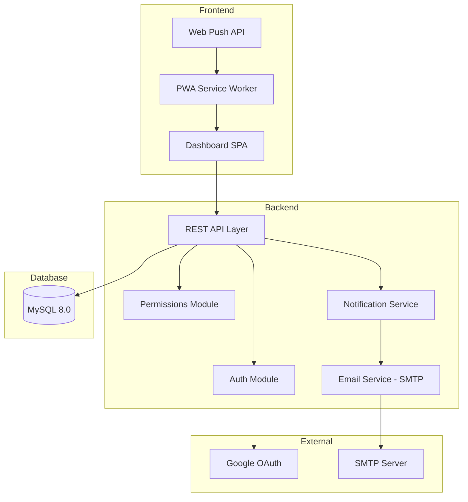
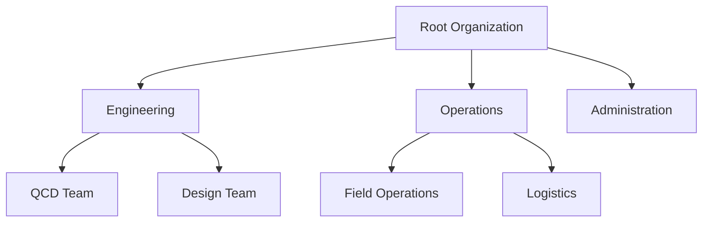
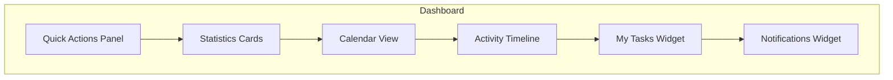
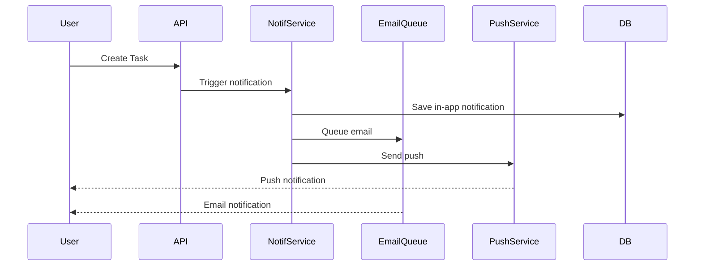

# DBEDC File Tracker - Enhancement Plan v2.0

## Executive Summary

This document outlines the comprehensive enhancement plan for the DBEDC File Tracker system. The upgrades include new modules for Letters, Departments, Users, and Settings management, along with significant improvements to the Dashboard, notification system, and overall user experience.

---

## Table of Contents

1. [System Architecture Overview](#1-system-architecture-overview)
2. [Database Schema Updates](#2-database-schema-updates)
3. [Letters Management Module](#3-letters-management-module)
4. [Departments Management Module](#4-departments-management-module)
5. [Users Management Module](#5-users-management-module)
6. [Settings Module](#6-settings-module)
7. [Dashboard Improvements](#7-dashboard-improvements)
8. [Notification System](#8-notification-system)
9. [Activity Timeline & Reports](#9-activity-timeline--reports)
10. [Role-Based Access Control](#10-role-based-access-control)
11. [Technical Implementation Plan](#11-technical-implementation-plan)
12. [File Structure](#12-file-structure)

---

## 1. System Architecture Overview

### Current Stack
- **Backend:** Pure PHP 8+ (no frameworks)
- **Frontend:** Vanilla HTML5, CSS3, JavaScript
- **Database:** MySQL 8.0
- **Authentication:** Google OAuth 2.0
- **Hosting:** Namecheap shared hosting

### Architecture Diagram



---

## 2. Database Schema Updates

### New Tables Required

The existing [`sql/migration.sql`](sql/migration.sql:1) already contains most required tables. Minor updates needed:

#### 2.1 Add `user_preferences` Table
```sql
CREATE TABLE user_preferences (
    id CHAR(26) PRIMARY KEY,
    user_id CHAR(26) NOT NULL UNIQUE,
    quick_actions JSON DEFAULT NULL,
    dashboard_layout JSON DEFAULT NULL,
    theme_preference VARCHAR(20) DEFAULT 'system',
    created_at TIMESTAMP DEFAULT CURRENT_TIMESTAMP,
    updated_at TIMESTAMP DEFAULT CURRENT_TIMESTAMP ON UPDATE CURRENT_TIMESTAMP,
    FOREIGN KEY (user_id) REFERENCES users(id) ON DELETE CASCADE
);
```

#### 2.2 Add `email_queue` Table
```sql
CREATE TABLE email_queue (
    id CHAR(26) PRIMARY KEY,
    recipient_email VARCHAR(255) NOT NULL,
    recipient_name VARCHAR(255),
    subject VARCHAR(500) NOT NULL,
    body TEXT NOT NULL,
    template VARCHAR(50) DEFAULT NULL,
    status ENUM('pending', 'sent', 'failed') DEFAULT 'pending',
    attempts INT DEFAULT 0,
    error_message TEXT,
    scheduled_at TIMESTAMP DEFAULT CURRENT_TIMESTAMP,
    sent_at TIMESTAMP NULL,
    created_at TIMESTAMP DEFAULT CURRENT_TIMESTAMP,
    INDEX idx_status (status),
    INDEX idx_scheduled (scheduled_at)
);
```

#### 2.3 Add `push_subscriptions` Table
```sql
CREATE TABLE push_subscriptions (
    id CHAR(26) PRIMARY KEY,
    user_id CHAR(26) NOT NULL,
    endpoint TEXT NOT NULL,
    p256dh_key TEXT NOT NULL,
    auth_key TEXT NOT NULL,
    user_agent TEXT,
    is_active BOOLEAN DEFAULT TRUE,
    created_at TIMESTAMP DEFAULT CURRENT_TIMESTAMP,
    last_used TIMESTAMP NULL,
    FOREIGN KEY (user_id) REFERENCES users(id) ON DELETE CASCADE,
    INDEX idx_user (user_id),
    INDEX idx_active (is_active)
);
```

#### 2.4 Update `letters` Table
Add columns for bulk import tracking:
```sql
ALTER TABLE letters ADD COLUMN import_batch_id CHAR(26) DEFAULT NULL;
ALTER TABLE letters ADD COLUMN import_row_number INT DEFAULT NULL;
ALTER TABLE letters ADD INDEX idx_import_batch (import_batch_id);
```

---

## 3. Letters Management Module

### 3.1 Features Overview

| Feature | Description | Role Access |
|---------|-------------|-------------|
| View Letters | Table/Grid view with filters | All roles |
| Create Letter | Single letter creation | Admin, Manager, Member |
| Bulk Import | Spreadsheet-style bulk entry | Admin, Manager |
| Bulk Delete | Delete multiple letters | Admin |
| Update Status | Change letter status | Admin, Manager, Member |
| Assign Tasks | Create tasks from letters | Admin, Manager, Member |
| Export | Export to CSV/Excel | Admin, Manager |
| PDF Upload | Upload PDF attachments | Admin, Manager, Member |

### 3.2 UI Layout - Spreadsheet Style Bulk Import

```mermaid
flowchart LR
    subgraph Bulk Import Interface
        HEADER[Column Headers: Ref No | Stakeholder | Subject | Date | Priority | PDF]
        ROW1[Row 1: Editable cells with dropdowns]
        ROW2[Row 2: Editable cells with dropdowns]
        ROW3[Row 3: Editable cells with dropdowns]
        ADDROW[+ Add Row Button]
        ACTIONS[Save All | Clear | Import CSV]
    end
    
    HEADER --> ROW1
    ROW1 --> ROW2
    ROW2 --> ROW3
    ROW3 --> ADDROW
    ADDROW --> ACTIONS
```

### 3.3 Letters Tab Components

```
Letters Tab
├── View Toggle (Table | Grid | Calendar)
├── Filters Bar
│   ├── Search (Reference, Subject)
│   ├── Stakeholder Dropdown
│   ├── Priority Dropdown
│   ├── Status Dropdown
│   ├── Date Range Picker
│   └── Department Filter
├── Bulk Actions Bar (when items selected)
│   ├── Delete Selected
│   ├── Update Status
│   ├── Assign Tasks
│   └── Export Selected
├── Letters Table/Grid
│   ├── Checkbox Column
│   ├── Reference No
│   ├── Stakeholder Badge
│   ├── Subject
│   ├── Received Date
│   ├── Priority Badge
│   ├── Status Badge
│   ├── Tasks Count
│   ├── PDF Icon/Link
│   └── Actions (View, Edit, Delete)
└── Bulk Import Modal
    ├── Spreadsheet Grid
    ├── Add Row Button
    ├── Import CSV Button
    ├── Validation Indicators
    └── Save All Button
```

### 3.4 API Endpoints

| Method | Endpoint | Description |
|--------|----------|-------------|
| GET | `/api/letters.php` | List letters with filters |
| GET | `/api/letters.php?id={id}` | Get single letter |
| POST | `/api/letters.php` | Create single letter |
| POST | `/api/letters.php?bulk=true` | Bulk create letters |
| PATCH | `/api/letters.php` | Update letter |
| PATCH | `/api/letters.php?bulk=true` | Bulk update letters |
| DELETE | `/api/letters.php` | Delete letter |
| DELETE | `/api/letters.php?bulk=true` | Bulk delete letters |
| GET | `/api/letters.php?export=csv` | Export to CSV |

---

## 4. Departments Management Module

### 4.1 Features Overview

| Feature | Description | Role Access |
|---------|-------------|-------------|
| View Departments | Hierarchical tree/table view | All roles |
| Create Department | Add new department | Admin |
| Edit Department | Update department details | Admin |
| Delete Department | Remove department | Admin |
| Assign Manager | Set department head | Admin |
| View Hierarchy | Visual org chart | All roles |

### 4.2 Department Hierarchy Structure



### 4.3 Departments Tab Components

```
Departments Tab
├── View Toggle (Tree | Table)
├── Search Bar
├── Add Department Button (Admin only)
├── Department Tree/Table
│   ├── Department Name
│   ├── Description
│   ├── Manager Name
│   ├── User Count
│   ├── Task Count
│   ├── Parent Department
│   └── Actions (Edit, Delete)
└── Department Form Modal
    ├── Name Input
    ├── Description Textarea
    ├── Parent Department Dropdown
    ├── Manager Dropdown (Users)
    └── Active Toggle
```

### 4.4 API Endpoints

| Method | Endpoint | Description |
|--------|----------|-------------|
| GET | `/api/departments.php` | List all departments |
| GET | `/api/departments.php?id={id}` | Get single department |
| GET | `/api/departments.php?tree=true` | Get hierarchy tree |
| POST | `/api/departments.php` | Create department |
| PATCH | `/api/departments.php` | Update department |
| DELETE | `/api/departments.php` | Delete department |

---

## 5. Users Management Module

### 5.1 Features Overview

| Feature | Description | Role Access |
|---------|-------------|-------------|
| View Users | Table/Grid view | Admin, Manager (dept only) |
| Edit User | Update role, department | Admin |
| Deactivate User | Disable user access | Admin |
| View Profile | User details and stats | All (own profile) |
| Change Role | Modify user permissions | Admin |

### 5.2 User Roles & Permissions Matrix

| Permission | Admin | Manager | Member | Viewer |
|------------|-------|---------|--------|--------|
| View All Users | ✅ | ❌ | ❌ | ❌ |
| View Dept Users | ✅ | ✅ | ❌ | ❌ |
| Edit Any User | ✅ | ❌ | ❌ | ❌ |
| Change Roles | ✅ | ❌ | ❌ | ❌ |
| Deactivate Users | ✅ | ❌ | ❌ | ❌ |
| View Own Profile | ✅ | ✅ | ✅ | ✅ |
| Edit Own Profile | ✅ | ✅ | ✅ | ✅ |

### 5.3 Users Tab Components

```
Users Tab
├── Search Bar
├── Filters
│   ├── Role Dropdown
│   ├── Department Dropdown
│   └── Status (Active/Inactive)
├── Users Table
│   ├── Avatar
│   ├── Name
│   ├── Email
│   ├── Role Badge
│   ├── Department
│   ├── Last Login
│   ├── Status Badge
│   └── Actions (Edit, Deactivate)
└── User Edit Modal
    ├── Profile Info (read-only from Google)
    ├── Role Dropdown
    ├── Department Dropdown
    ├── Notification Preferences
    └── Active Toggle
```

### 5.4 API Endpoints

| Method | Endpoint | Description |
|--------|----------|-------------|
| GET | `/api/users.php` | List users |
| GET | `/api/users.php?id={id}` | Get single user |
| GET | `/api/users.php?me` | Get current user |
| PATCH | `/api/users.php` | Update user |
| DELETE | `/api/users.php` | Deactivate user |

---

## 6. Settings Module

### 6.1 Features Overview

| Feature | Description | Role Access |
|---------|-------------|-------------|
| Branding | Logo, Company Name, Colors | Admin |
| Stakeholders | CRUD for stakeholders | Admin |
| Email Settings | SMTP configuration | Admin |
| System Settings | General preferences | Admin |

### 6.2 Settings Tab Components

```
Settings Tab
├── Branding Section
│   ├── Logo Upload
│   ├── Company Name Input
│   ├── Primary Color Picker
│   └── Secondary Color Picker
├── Stakeholders Section
│   ├── Stakeholders Table
│   │   ├── Name
│   │   ├── Code
│   │   ├── Color Badge
│   │   ├── Icon
│   │   └── Actions (Edit, Delete)
│   └── Add Stakeholder Button
├── Email Settings Section
│   ├── SMTP Host
│   ├── SMTP Port
│   ├── SMTP Username
│   ├── SMTP Password
│   ├── From Email
│   ├── From Name
│   └── Test Email Button
└── System Settings Section
    ├── Default Priority
    ├── Task Due Date Default
    └── Notification Preferences
```

### 6.3 API Endpoints

| Method | Endpoint | Description |
|--------|----------|-------------|
| GET | `/api/settings.php` | Get all settings |
| GET | `/api/settings.php?group={group}` | Get settings by group |
| PATCH | `/api/settings.php` | Update settings |
| GET | `/api/stakeholders.php` | List stakeholders |
| POST | `/api/stakeholders.php` | Create stakeholder |
| PATCH | `/api/stakeholders.php` | Update stakeholder |
| DELETE | `/api/stakeholders.php` | Delete stakeholder |

---

## 7. Dashboard Improvements

### 7.1 Enhanced Dashboard Layout



### 7.2 Quick Actions Panel

```
Quick Actions (Customizable)
├── Primary Actions
│   ├── + Add New Letter
│   ├── + Create Task
│   ├── 📤 Bulk Upload
│   └── 🔍 Quick Search
├── View Actions
│   ├── 📋 My Pending Tasks
│   ├── ⚠️ Overdue Tasks
│   ├── 📊 Department Stats
│   └── 📅 Calendar View
├── Export Actions
│   ├── 📥 Export Reports
│   └── 📄 Export Letters
└── Notification Actions
    ├── 🔔 View Notifications
    └── ⚙️ Notification Settings
```

### 7.3 Statistics Cards

| Card | Metrics |
|------|---------|
| Total Letters | Count, This Week, This Month |
| Total Tasks | Pending, In Progress, Completed |
| My Tasks | Assigned to me, Overdue |
| Department Stats | Team tasks, Completion rate |
| Recent Activity | Last 5 activities |

### 7.4 Calendar View Features

```
Calendar View
├── Month/Week/Day Toggle
├── Letter Events (by received date)
├── Task Events (by due date)
├── Color Coding
│   ├── Blue: Letters
│   ├── Green: Completed Tasks
│   ├── Yellow: Pending Tasks
│   └── Red: Overdue Tasks
├── Click to View Details
└── Drag to Reschedule (due dates)
```

---

## 8. Notification System

### 8.1 Notification Types

| Type | Trigger | Channels |
|------|---------|----------|
| Task Assigned | New task assignment | In-app, Email, Push |
| Task Updated | Status change | In-app, Email |
| Deadline Approaching | 24h before due | In-app, Email, Push |
| Deadline Passed | Task overdue | In-app, Email, Push |
| Letter Created | New letter added | In-app |
| Mention | User mentioned in comment | In-app, Email, Push |

### 8.2 Notification Flow



### 8.3 Notifications Tab Components

```
Notifications Tab
├── Filter Tabs
│   ├── All
│   ├── Unread
│   ├── Tasks
│   ├── Deadlines
│   └── Mentions
├── Mark All Read Button
├── Notification List
│   ├── Icon (by type)
│   ├── Title
│   ├── Message
│   ├── Timestamp
│   ├── Read/Unread Indicator
│   └── Action Link
└── Notification Settings
    ├── Email Notifications Toggle
    ├── Push Notifications Toggle
    └── Per-type Settings
```

### 8.4 Push Notification Implementation

```javascript
// Service Worker Registration
if ('serviceWorker' in navigator && 'PushManager' in window) {
    navigator.serviceWorker.register('/sw.js')
        .then(registration => {
            return registration.pushManager.subscribe({
                userVisibleOnly: true,
                applicationServerKey: VAPID_PUBLIC_KEY
            });
        })
        .then(subscription => {
            // Send subscription to server
            API.post('/api/push-subscribe.php', subscription);
        });
}
```

### 8.5 API Endpoints

| Method | Endpoint | Description |
|--------|----------|-------------|
| GET | `/api/notifications.php` | List notifications |
| PATCH | `/api/notifications.php?read={id}` | Mark as read |
| PATCH | `/api/notifications.php?read_all=true` | Mark all read |
| DELETE | `/api/notifications.php` | Delete notification |
| POST | `/api/push-subscribe.php` | Save push subscription |
| DELETE | `/api/push-subscribe.php` | Remove subscription |

---

## 9. Activity Timeline & Reports

### 9.1 Activity Timeline Features

```
Activity Timeline
├── Filter by
│   ├── Date Range
│   ├── Activity Type
│   ├── User
│   └── Entity (Letter/Task)
├── Timeline View
│   ├── Timestamp
│   ├── User Avatar
│   ├── Activity Description
│   ├── Entity Link
│   └── Metadata
└── Export Timeline
```

### 9.2 Activity Types

| Activity Type | Description |
|---------------|-------------|
| `letter_created` | New letter uploaded |
| `letter_updated` | Letter details modified |
| `letter_deleted` | Letter removed |
| `task_created` | New task created |
| `task_assigned` | Task assigned to user |
| `task_status_changed` | Task status updated |
| `task_completed` | Task marked complete |
| `user_login` | User logged in |
| `settings_updated` | System settings changed |

### 9.3 Export/Reports Features

```
Reports Module
├── Report Types
│   ├── Letters Report
│   │   ├── By Stakeholder
│   │   ├── By Date Range
│   │   └── By Status
│   ├── Tasks Report
│   │   ├── By Status
│   │   ├── By Assignee
│   │   ├── By Department
│   │   └── Completion Time
│   ├── User Activity Report
│   └── Department Performance
├── Export Formats
│   ├── CSV
│   ├── Excel (XLSX)
│   └── PDF
└── Scheduled Reports (Future)
```

### 9.4 API Endpoints

| Method | Endpoint | Description |
|--------|----------|-------------|
| GET | `/api/activities.php` | List activities |
| GET | `/api/activities.php?entity={type}&id={id}` | Entity activities |
| GET | `/api/reports.php?type={type}` | Generate report |
| GET | `/api/reports.php?export={format}` | Export report |

---

## 10. Role-Based Access Control

### 10.1 Complete Permission Matrix

```
┌─────────────────────┬───────┬─────────┬────────┬────────┐
│ Feature             │ Admin │ Manager │ Member │ Viewer │
├─────────────────────┼───────┼─────────┼────────┼────────┤
│ DASHBOARD           │       │         │        │        │
│ View All Stats      │   ✅   │    ❌    │   ❌    │   ❌    │
│ View Dept Stats     │   ✅   │    ✅    │   ❌    │   ❌    │
│ View Own Stats      │   ✅   │    ✅    │   ✅    │   ✅    │
│ Quick Actions       │   ✅   │    ✅    │   ✅    │   ❌    │
│ Calendar View       │   ✅   │    ✅    │   ✅    │   ✅    │
├─────────────────────┼───────┼─────────┼────────┼────────┤
│ LETTERS             │       │         │        │        │
│ View All            │   ✅   │    ❌    │   ❌    │   ❌    │
│ View Department     │   ✅   │    ✅    │   ❌    │   ❌    │
│ View Assigned       │   ✅   │    ✅    │   ✅    │   ✅    │
│ Create              │   ✅   │    ✅    │   ✅    │   ❌    │
│ Update Any          │   ✅   │    ❌    │   ❌    │   ❌    │
│ Update Department   │   ✅   │    ✅    │   ❌    │   ❌    │
│ Update Own          │   ✅   │    ✅    │   ✅    │   ❌    │
│ Delete Any          │   ✅   │    ❌    │   ❌    │   ❌    │
│ Delete Own          │   ✅   │    ✅    │   ❌    │   ❌    │
│ Bulk Import         │   ✅   │    ✅    │   ❌    │   ❌    │
│ Export              │   ✅   │    ✅    │   ❌    │   ❌    │
├─────────────────────┼───────┼─────────┼────────┼────────┤
│ TASKS               │       │         │        │        │
│ View All            │   ✅   │    ❌    │   ❌    │   ❌    │
│ View Department     │   ✅   │    ✅    │   ❌    │   ❌    │
│ View Assigned       │   ✅   │    ✅    │   ✅    │   ✅    │
│ Create              │   ✅   │    ✅    │   ✅    │   ❌    │
│ Assign Any User     │   ✅   │    ❌    │   ❌    │   ❌    │
│ Assign Dept User    │   ✅   │    ✅    │   ❌    │   ❌    │
│ Update Any          │   ✅   │    ❌    │   ❌    │   ❌    │
│ Update Department   │   ✅   │    ✅    │   ❌    │   ❌    │
│ Update Own          │   ✅   │    ✅    │   ✅    │   ❌    │
│ Delete Any          │   ✅   │    ❌    │   ❌    │   ❌    │
│ Delete Own          │   ✅   │    ✅    │   ❌    │   ❌    │
├─────────────────────┼───────┼─────────┼────────┼────────┤
│ DEPARTMENTS         │       │         │        │        │
│ View All            │   ✅   │    ✅    │   ✅    │   ✅    │
│ Create              │   ✅   │    ❌    │   ❌    │   ❌    │
│ Update              │   ✅   │    ❌    │   ❌    │   ❌    │
│ Delete              │   ✅   │    ❌    │   ❌    │   ❌    │
├─────────────────────┼───────┼─────────┼────────┼────────┤
│ USERS               │       │         │        │        │
│ View All            │   ✅   │    ❌    │   ❌    │   ❌    │
│ View Department     │   ✅   │    ✅    │   ❌    │   ❌    │
│ Edit Any            │   ✅   │    ❌    │   ❌    │   ❌    │
│ Change Roles        │   ✅   │    ❌    │   ❌    │   ❌    │
│ Deactivate          │   ✅   │    ❌    │   ❌    │   ❌    │
├─────────────────────┼───────┼─────────┼────────┼────────┤
│ SETTINGS            │       │         │        │        │
│ View                │   ✅   │    ✅    │   ✅    │   ✅    │
│ Update Branding     │   ✅   │    ❌    │   ❌    │   ❌    │
│ Update Stakeholders │   ✅   │    ❌    │   ❌    │   ❌    │
│ Update Email        │   ✅   │    ❌    │   ❌    │   ❌    │
├─────────────────────┼───────┼─────────┼────────┼────────┤
│ NOTIFICATIONS       │       │         │        │        │
│ View Own            │   ✅   │    ✅    │   ✅    │   ✅    │
│ Send to Any         │   ✅   │    ❌    │   ❌    │   ❌    │
│ Send to Department  │   ✅   │    ✅    │   ❌    │   ❌    │
├─────────────────────┼───────┼─────────┼────────┼────────┤
│ REPORTS             │       │         │        │        │
│ View All Reports    │   ✅   │    ❌    │   ❌    │   ❌    │
│ View Dept Reports   │   ✅   │    ✅    │   ❌    │   ❌    │
│ View Own Reports    │   ✅   │    ✅    │   ✅    │   ✅    │
│ Export              │   ✅   │    ✅    │   ❌    │   ❌    │
└─────────────────────┴───────┴─────────┴────────┴────────┘
```

### 10.2 Navigation Visibility by Role

```
Navigation Tabs
├── Dashboard        → All Roles
├── My Tasks         → All Roles
├── All Tasks        → Admin, Manager
├── Letters          → All Roles (filtered by permission)
├── Departments      → All Roles (read-only for non-admin)
├── Users            → Admin, Manager (dept only)
├── Notifications    → All Roles
├── Settings         → Admin only (full), Others (view only)
└── Analytics        → All Roles (filtered by permission)
```

---

## 11. Technical Implementation Plan

### 11.1 Implementation Phases

#### Phase 1: Database & Core Infrastructure
- [ ] Update SQL migration file with new tables
- [ ] Update [`includes/db.php`](includes/db.php:1) with new helper functions
- [ ] Update [`includes/permissions.php`](includes/permissions.php:1) with enhanced RBAC
- [ ] Create email service module
- [ ] Create push notification service module

#### Phase 2: Settings & Stakeholders Module
- [ ] Create `/api/settings.php` endpoint
- [ ] Create `/api/stakeholders.php` endpoint
- [ ] Add Settings tab UI in [`dashboard.php`](dashboard.php:1)
- [ ] Implement branding customization
- [ ] Implement stakeholder CRUD

#### Phase 3: Departments Module
- [ ] Update `/api/departments.php` endpoint
- [ ] Add Departments tab UI
- [ ] Implement hierarchy tree view
- [ ] Implement department CRUD with manager assignment

#### Phase 4: Users Module
- [ ] Update `/api/users.php` endpoint
- [ ] Add Users tab UI
- [ ] Implement user management (role, department assignment)
- [ ] Implement user deactivation

#### Phase 5: Letters Module Enhancement
- [ ] Update `/api/letters.php` with bulk operations
- [ ] Add Letters tab UI with table/grid views
- [ ] Implement spreadsheet-style bulk import
- [ ] Implement bulk delete, status update
- [ ] Implement export functionality

#### Phase 6: Dashboard Improvements
- [ ] Redesign dashboard layout
- [ ] Implement quick actions panel
- [ ] Add statistics cards
- [ ] Implement calendar view
- [ ] Add activity timeline widget

#### Phase 7: Notification System
- [ ] Create `/api/notifications.php` endpoint
- [ ] Create `/api/push-subscribe.php` endpoint
- [ ] Update [`sw.js`](sw.js:1) for push notifications
- [ ] Implement email notification service
- [ ] Add Notifications tab UI
- [ ] Implement notification preferences

#### Phase 8: Activity & Reports
- [ ] Create `/api/activities.php` endpoint
- [ ] Create `/api/reports.php` endpoint
- [ ] Implement activity timeline view
- [ ] Implement report generation
- [ ] Implement export functionality

#### Phase 9: Testing & Polish
- [ ] Test all CRUD operations
- [ ] Test role-based access
- [ ] Test notifications (email + push)
- [ ] Test bulk operations
- [ ] Performance optimization
- [ ] UI/UX polish

---

## 12. File Structure

### 12.1 Updated Project Structure

```
DBEDC-File-Handling/
├── index.php
├── login.php
├── callback.php
├── dashboard.php
├── logout.php
├── manifest.json
├── sw.js (updated for push)
├── .htaccess
│
├── api/
│   ├── letters.php (enhanced)
│   ├── tasks.php
│   ├── users.php (enhanced)
│   ├── departments.php (enhanced)
│   ├── analytics.php
│   ├── settings.php (new)
│   ├── stakeholders.php (new)
│   ├── notifications.php (new)
│   ├── activities.php (new)
│   ├── reports.php (new)
│   └── push-subscribe.php (new)
│
├── includes/
│   ├── db.php
│   ├── auth.php
│   ├── permissions.php (enhanced)
│   ├── email.php (new)
│   ├── push.php (new)
│   └── notifications.php (new)
│
├── assets/
│   ├── css/
│   │   └── app.css (enhanced)
│   ├── js/
│   │   ├── app.js (enhanced)
│   │   ├── letters.js (new)
│   │   ├── departments.js (new)
│   │   ├── users.js (new)
│   │   ├── settings.js (new)
│   │   ├── notifications.js (new)
│   │   ├── calendar.js (new)
│   │   └── reports.js (new)
│   └── uploads/
│
├── sql/
│   └── migration.sql (updated)
│
└── plans/
    └── ENHANCEMENT_PLAN_V2.md
```

### 12.2 New API Files Summary

| File | Purpose |
|------|---------|
| `api/settings.php` | System settings CRUD |
| `api/stakeholders.php` | Stakeholder management |
| `api/notifications.php` | In-app notifications |
| `api/activities.php` | Activity timeline |
| `api/reports.php` | Report generation & export |
| `api/push-subscribe.php` | Push subscription management |

### 12.3 New Include Files Summary

| File | Purpose |
|------|---------|
| `includes/email.php` | SMTP email sending |
| `includes/push.php` | Web Push API handling |
| `includes/notifications.php` | Notification creation & dispatch |

---

## Summary

This enhancement plan transforms the DBEDC File Tracker into a comprehensive document and task management system with:

1. **Letters Module** - Full CRUD with spreadsheet-style bulk import, filtering, and export
2. **Departments Module** - Hierarchical department management with manager assignment
3. **Users Module** - User management with role-based access (Google Auth only)
4. **Settings Module** - Branding customization and stakeholder management
5. **Dashboard** - Quick actions, statistics, calendar view, and activity timeline
6. **Notifications** - In-app, email (SMTP), and push notifications (PWA Web Push)
7. **Reports** - Activity timeline and exportable reports

All features respect the role-based access control system with Admin, Manager, Member, and Viewer roles.

---

**Document Version:** 2.0  
**Created:** February 2026  
**Status:** Ready for Review
